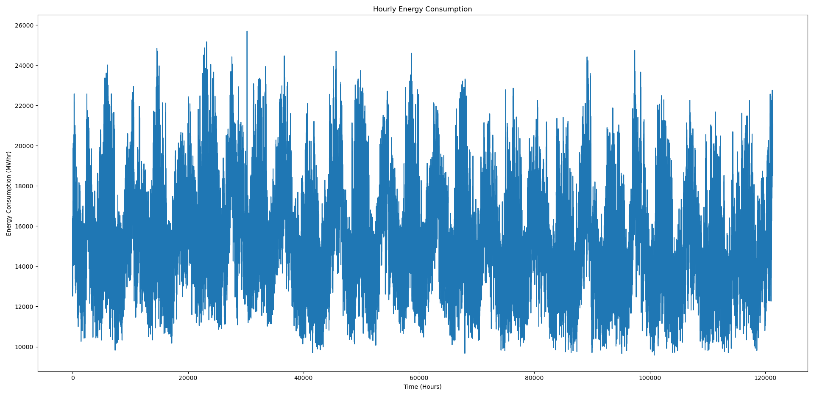
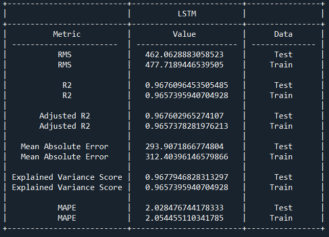
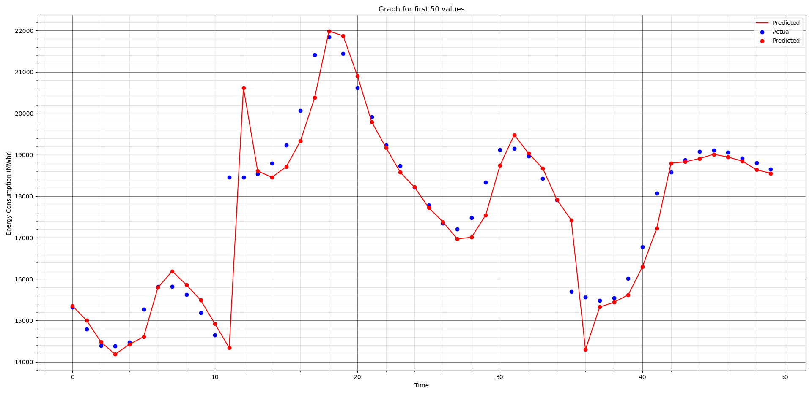

# Hourly Energy Consumption Data

This dataset is considered to analyze and predict the hourly energy consumption of a building.
Estimating the energy consumption of a building in advance plays a crucial role in building energy management since, using this data the operator gets an idea of the future energy expenditure and can make certain arrangements to ensure it stays that way.
[link to dataset](https://www.kaggle.com/robikscube/hourly-energy-consumption)

Data visualization:

The hourly energy energy consumption is predicted using a time series and supervised machine learning. A time series estimation problem can be converted to a supervised ML problem using some data transformation technique.

## Supervised machine learning-based hourly energy consumption prediction
  Time series modeling can be done via supervised ML techniques by pre-processing the dataset such that it becomes a regression (supervised ML) problem. In regression, an ML model is trained on a training dataset (input-output pairs), and then predictions are obtained for the test dataset (inputs only). A univariate time series prediction problem can be reduced to a regression problem by considering k-1 preceding data units as input and kth data unit as output for training. For instance, in a univariate time series with n number of data points, one can have the following input-output training pairs: (1, 2, …, k-1; k), (2, 3, …, k; k+1), …, (n-k, n-k+1, …, n-1; n) where k < n. The value of k was considered as 5 in this project. 

## Performance evaluation metrics
* Mean square error (MSE)
* Root mean square error (RMSE)
* R2
* Adjusted R2
* Explained Variance Score
* Mean absolute percentage error (MAPE)

## Results
Various ML models were implemented and tested out of which the two best performing are discussed here:

### LSTM:
LSTM is an advanced deep learning model which have shown state-of-the-art performance in time series prediction. 
Following is the performance evaluation of the model:

Further for visualization purpose, the first 50 predictions made by the model are plotted with the actual predictions:

